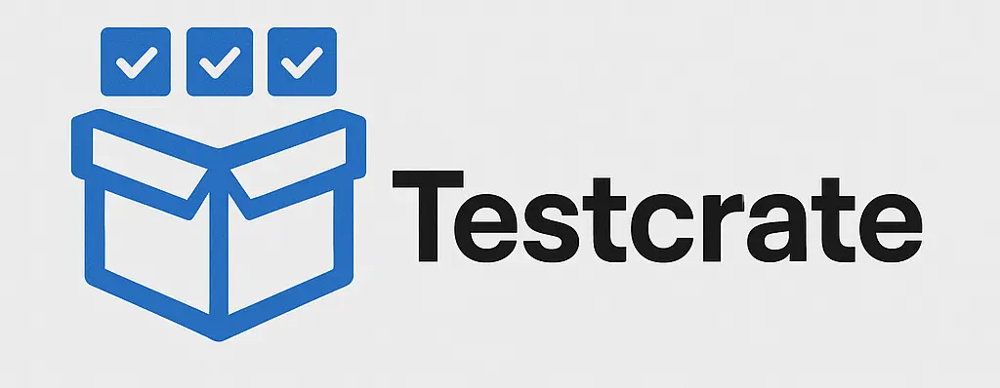

# TestCrate



> ⚠️ **Work in Progress**: This project is currently under active development. Features, APIs, and documentation may change without notice. Use at your own risk.

A modern, cloud-native test reporting and management platform built for the Cloudflare Workers ecosystem. TestCrate provides a comprehensive API for storing, organizing, and exporting test results with support for hierarchical builds, Allure integration, and multiple export formats.

## 🚀 Features

### Core Functionality
- **Project Management**: Organize test results by projects with configurable categories
- **Hierarchical Builds**: Support for parent-child build relationships with nested test execution
- **Test Artifacts Storage**: Store and manage test results, containers, and attachments
- **Role-Based Access Control**: Three-tier authentication system (user, agent, admin)
- **Real-time Status Tracking**: Monitor build stages (scheduled, running, finished, interrupted)

### Export & Reporting
- **Allure Integration**: Export test results in Allure format for rich HTML reports
- **Markdown Reports**: Generate human-readable markdown reports for build results
- **Multiple Export Formats**: Support for various output formats including tar archives
- **Build Hierarchy Visualization**: Export nested build structures with full context

### Technical Features
- **Cloudflare Workers**: Built for edge computing with global distribution
- **D1 Database**: SQLite-compatible database for reliable data persistence
- **TypeScript**: Fully typed with Zod schema validation
- **RESTful API**: Comprehensive REST API with automatic request validation
- **Monorepo Architecture**: Modular design with separate packages for core, server, and database layers

## 🏗️ Architecture

TestCrate follows a modular monorepo architecture:

```
packages/
├── core/           # Core business logic and schemas
├── core-d1/        # D1 database implementation
├── database-d1/    # Database utilities and migrations
└── server/         # Cloudflare Workers server
```

### Key Components

- **Controllers**: Handle business logic for projects, builds, attachments, and stored items
- **Export Controllers**: Generate reports in Allure and Markdown formats
- **Database Layer**: D1-compatible database operations with migrations
- **Authentication**: JWT-based authentication with role-based permissions
- **Schema Validation**: Zod-powered request/response validation

## 📋 API Overview

### Authentication Levels
- **User**: Read access to projects and builds
- **Agent**: Write access to builds and test artifacts
- **Admin**: Full access including project management and system operations

### Core Endpoints

#### Projects
- `GET /api/v1/projects` - List projects
- `GET /api/v1/projects/:projectId` - Get project details
- `PUT /api/v1/projects/:projectId` - Create/update project (admin)
- `PATCH /api/v1/projects/:projectId` - Partial update (admin)
- `DELETE /api/v1/projects/:projectId` - Delete project (admin)

#### Builds
- `GET /api/v1/projects/:projectId/builds` - List builds
- `GET /api/v1/projects/:projectId/builds/:buildId` - Get build details
- `GET /api/v1/projects/:projectId/builds/:buildId/all` - Get build with children
- `PUT /api/v1/projects/:projectId/builds/:buildId` - Create/update build (agent)
- `PATCH /api/v1/projects/:projectId/builds/:buildId` - Update build status (agent)
- `DELETE /api/v1/projects/:projectId/builds/:buildId` - Delete build (admin)

#### Test Artifacts
- `GET /api/v1/projects/:projectId/builds/:buildId/items/:itemId` - Get stored item
- `PUT /api/v1/projects/:projectId/builds/:buildId/items/:itemId` - Store test result (agent)
- `PATCH /api/v1/projects/:projectId/builds/:buildId/items/:itemId` - Update item (agent)
- `DELETE /api/v1/projects/:projectId/builds/:buildId/items/:itemId` - Delete item (agent)

#### Attachments
- `GET /api/v1/projects/:projectId/builds/:buildId/attachments` - List attachments
- `GET /api/v1/projects/:projectId/builds/:buildId/attachments/:attachmentId` - Get attachment
- `PUT /api/v1/projects/:projectId/builds/:buildId/attachments/:attachmentId` - Upload attachment (agent)

#### Export
- `GET /api/v1/projects/:projectId/builds/:buildId/export/allure-results` - Export as Allure results
- `GET /api/v1/projects/:projectId/builds/:buildId/export/markdown` - Export as Markdown report

## 🛠️ Development

### Prerequisites
- Node.js >= 20.18.0
- Yarn 4.9.2
- Cloudflare account (for deployment)

### Setup

1. **Clone the repository**
   ```bash
   git clone <repository-url>
   cd testcrate
   ```

2. **Install dependencies**
   ```bash
   yarn install
   ```

3. **Configure environment**
   ```bash
   # Copy example environment file
   cp packages/server/.dev.vars.example packages/server/.dev.vars

   # Edit .dev.vars with your API keys
   # USER_API_KEY=your-user-api-key
   # ADMIN_API_KEY=your-admin-api-key
   ```

4. **Start development server**
   ```bash
   cd packages/server
   yarn dev
   ```

### Available Scripts

- `yarn build` - Build the CLI and all packages
- `yarn test` - Run tests across all packages
- `yarn lint` - Lint all packages
- `yarn start` - Start the CLI

### Database Setup

TestCrate uses Cloudflare D1 for data persistence. The database schema is managed through migrations:

```bash
# View migration status
curl -H "Authorization: Bearer $ADMIN_API_KEY" \
  http://localhost:8787/api/private/migrations/status

# Apply pending migrations (automatic on deployment)
```

## 🚀 Deployment

### Cloudflare Workers

1. **Configure Wrangler**
   ```bash
   cd packages/server
   npx wrangler login
   ```

2. **Set secrets**
   ```bash
   npx wrangler secret put USER_API_KEY
   npx wrangler secret put ADMIN_API_KEY
   ```

3. **Deploy**
   ```bash
   yarn deploy
   ```

### Environment Configuration

The `wrangler.jsonc` file contains the deployment configuration:
- D1 database binding: `testcrate_db`
- Node.js compatibility enabled
- Observability features enabled

## 📊 Data Models

### Build Lifecycle
- **scheduled**: Build created, waiting to start
- **running**: Actively executing
- **finished**: Execution completed
- **interrupted**: Cancelled/killed

### Build Status
- **passed**: All tests passed
- **failed**: Some tests failed
- **broken**: Build infrastructure issues
- **skipped**: Build was skipped
- **unknown**: Status not yet determined

### Supported Test Artifacts
- **Allure Results**: Individual test results
- **Allure Containers**: Test suites and containers
- **Attachments**: Files, screenshots, logs

## 🔧 Usage Examples

### Creating a Project
```bash
curl -X PUT "https://your-worker.your-subdomain.workers.dev/api/v1/projects/my-project" \
  -H "Authorization: Bearer $ADMIN_API_KEY" \
  -H "Content-Type: application/json" \
  -d '{
    "name": "My Test Project",
    "description": "A comprehensive test suite"
  }'
```

### Creating a Build
```bash
curl -X PUT "https://your-worker.your-subdomain.workers.dev/api/v1/projects/my-project/builds/build-123" \
  -H "Authorization: Bearer $AGENT_API_KEY" \
  -H "Content-Type: application/json" \
  -d '{
    "name": "Integration Tests",
    "stage": "scheduled",
    "historyId": "a1b2c3d4e5f6789012345678901234567890abcdef"
  }'
```

### Updating Build Status
```bash
curl -X PATCH "https://your-worker.your-subdomain.workers.dev/api/v1/projects/my-project/builds/build-123" \
  -H "Authorization: Bearer $AGENT_API_KEY" \
  -H "Content-Type: application/json" \
  -d '{
    "stage": "finished",
    "status": "passed",
    "stop": 1714857600
  }'
```

### Exporting Results
```bash
# Export as Allure results
curl -H "Authorization: Bearer $USER_API_KEY" \
  "https://your-worker.your-subdomain.workers.dev/api/v1/projects/my-project/builds/build-123/export/allure-results" \
  -o allure-results.tar

# Export as Markdown report
curl -H "Authorization: Bearer $USER_API_KEY" \
  "https://your-worker.your-subdomain.workers.dev/api/v1/projects/my-project/builds/build-123/export/markdown" \
  -o test-report.md
```

## 🤝 Contributing

1. Fork the repository
2. Create a feature branch: `git checkout -b feature/amazing-feature`
3. Commit your changes: `git commit -m 'Add amazing feature'`
4. Push to the branch: `git push origin feature/amazing-feature`
5. Open a Pull Request

### Development Guidelines
- Follow the existing code style and patterns
- Add tests for new functionality
- Update documentation as needed
- Ensure all tests pass before submitting

## 📄 License

This project is licensed under the terms specified in the [LICENSE](LICENSE) file.

## 🆘 Support

For questions, issues, or contributions, please:
- Open an issue on GitHub
- Check the existing documentation
- Review the API schemas in `packages/core/src/schema/`

---

Built with ❤️ for the testing community
